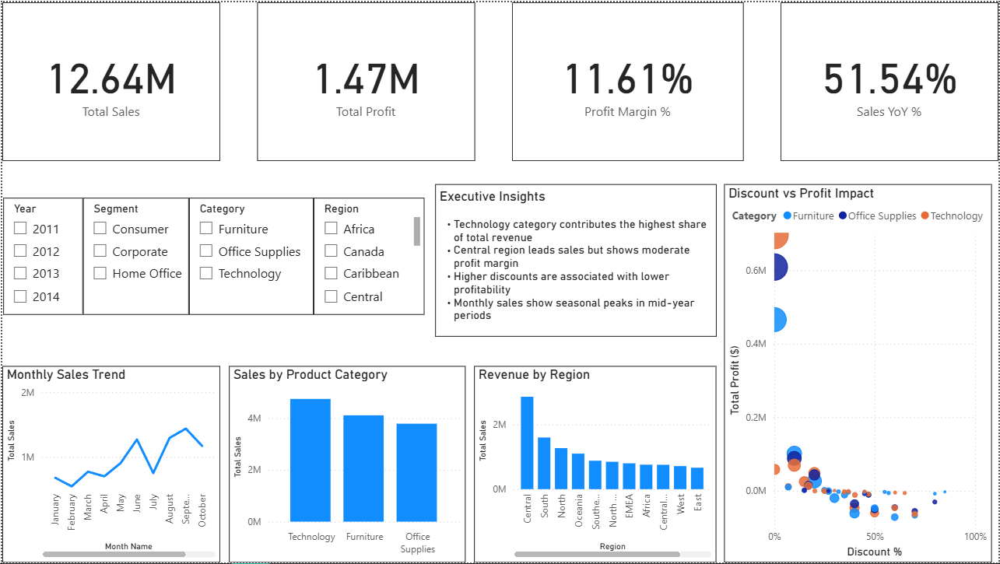

## Executive Sales & Profitability Dashboard — Power BI

### 📌 Project Overview
This project presents an **Executive-level Sales & Profitability Dashboard** built in **Power BI**, using the Global Superstore dataset. The objective of the dashboard is to support business leaders in monitoring revenue performance, profitability trends, regional contribution, and discount impact on margins.

The solution goes beyond visualization and demonstrates:
- **Data modeling using a star-schema**
- **DAX-based KPI measures and YoY growth**
- **Business-focused insight generation**
- **Clean, stakeholder-ready dashboard design**

---

### 🧱 Data Model & Approach
The original flat dataset was transformed into a **dimensional model**:

**Fact Table**
- Fact_Sales (Orders, Revenue, Quantity, Discount, Profit)

**Dimension Tables**
- Dim_Date  
- Dim_Customers  
- Dim_Products  
- Dim_Geography  

Relationships were designed in a **star-schema** to ensure analytical scalability and performance.

---

### 📊 Key Metrics (DAX Measures)
- Total Sales  
- Total Profit  
- Profit Margin %  
- Sales YoY %  
- Total Quantity  

Date-intelligence functions including `CALCULATE()` and `SAMEPERIODLASTYEAR()` were used to compute growth trends.

---

### 📈 Dashboard Features
The Executive Overview page includes:

- KPI strip (Sales, Profit, Margin, YoY Growth)
- Monthly sales trend analysis
- Sales by product category
- Regional performance comparison
- **Discount vs Profit impact analysis (scatter relationship)**
- Interactive slicers for Year, Segment, Category, and Region

> The dashboard is designed for **business decision‑making**, not only visualization.

---

### 🧠 Business Insights
From the analysis:

- Technology category contributes the highest share of total revenue  
- Central region leads sales but shows moderate profit margin  
- Higher discount levels are associated with lower profitability  
- Monthly sales show seasonal peaks in mid‑year periods  

These insights demonstrate how BI dashboards help organizations **translate data into decisions**.

---

### 🛠 Tools & Technologies
- Power BI (Data Modeling, DAX, Visualization)
- Power Query (Data transformation)
- Excel dataset (Global Superstore)

---

### 📂 Repository Contents
```
pbix/   → Power BI dashboard file
data/   → Source dataset
images/ → Dashboard preview screenshot
README  → Project documentation
```

---

### 🖼 Dashboard Preview
```

```

---

### 🚀 Future Enhancements (Optional)
- Product profitability deep‑dive page
- Customer contribution & Top‑10 revenue share
- Discount optimization insight module

---

### 📌 Project Status
This dashboard is complete and portfolio‑ready.
